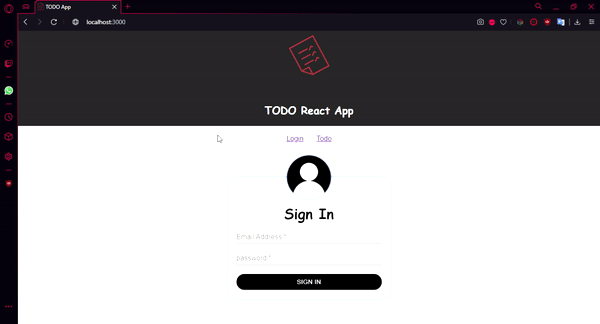

  

<h1 align="center">1.2 React Material</h1>

# Running instructions

Install npm the last version (currently 6.9.0)
Clone the repository https://github.com/migue1994/IETI-LAB02.git and go to the folder IETI-LAB02.
Type in the command prompt
npm i
npm start

# Author

Miguel Ángel Rivera Rojas
   
# Application demo

### Username: miguel.rivera-r@mail.escuelaing.edu.co
### Password: 123
